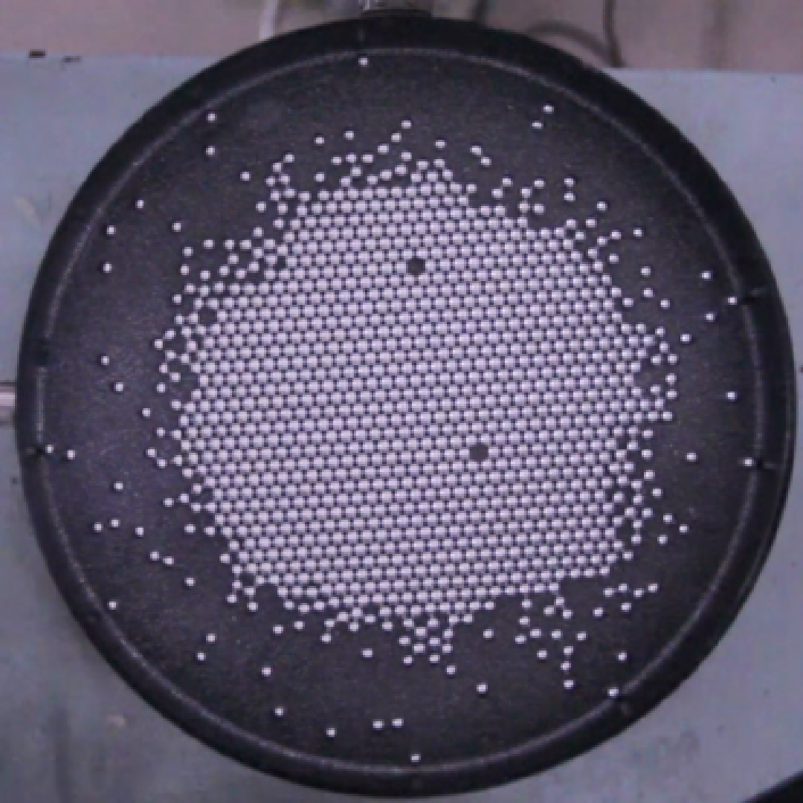

## Self Assembly

Problem 14 from [IYPT 2019](https://www.iypt.org/problems/problems-for-the-32nd-iypt-2019/)

See the [Reference](SelfAssembly/note/0727.md)

## Polygon Vortex

Problem 12 of from [IYPT 2020](https://www.iypt.org/problems/iypt-2020-problems/)

Watch [background Video](https://www.youtube.com/watch?v=I1vhRJo0Eik&list=PLyHSINW6AVOWg6ufseZc06MSiRRx4o17L&index=9)

Please use [Geogebra](https://www.geogebra.org/) to open and view the file `FFT/Fourier.ggb`
The rest of the files are all MATLAB.

## FFT Application in Optics

