# Flat Self Assembly

fluid -> Hexatic -> crystal

## Theoretical models

* Equilibrium Monte-Carlo Simulation [^2]
* KTHNY theory [^3]
* mode coupling theory(MCT) [^4]
* Berezinskii-Kosterlitz-Thouless (BKT) theory of transition [^13]

## Analysis Methods

### Time-averaged photograph

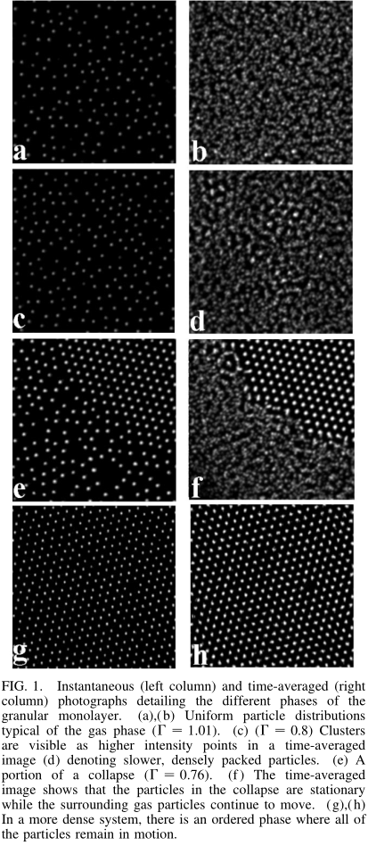 [^1]

### Radial Density Distribution Function

$$
G(r)=\langle\rho(0) \rho(r)\rangle /\langle\rho\rangle^{2}
$$

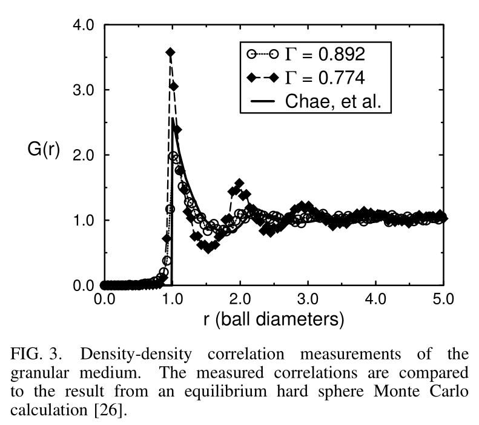[^1]

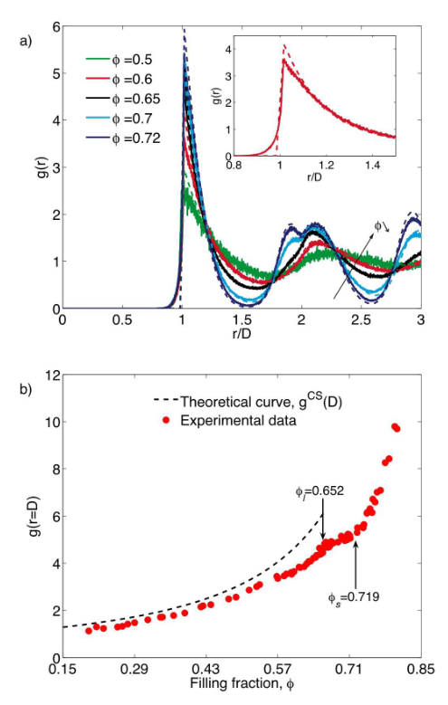[^2]

### Velocity Distribution Function

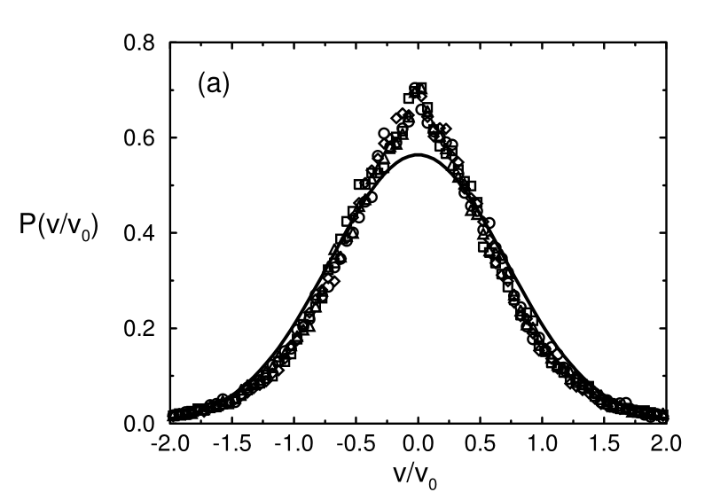
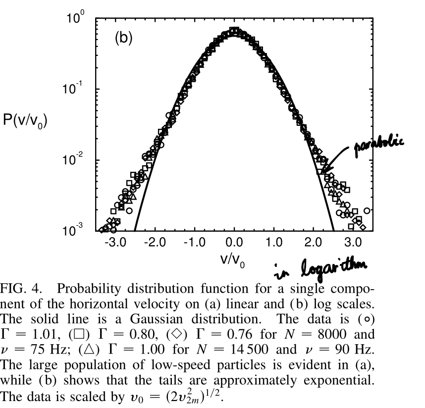[^1]

### Lindemann Ratio $\gamma_m$

$$
\gamma_{m}=\sqrt{\left\langle( \vec{r} -\langle \vec{r} \rangle)^{2}\right\rangle} / L
$$

where r is the positional vector of the particles and L is the bond length between (Voronoi) nearest neighbors, corresponding to the average lattice spacing in the crystal phase.

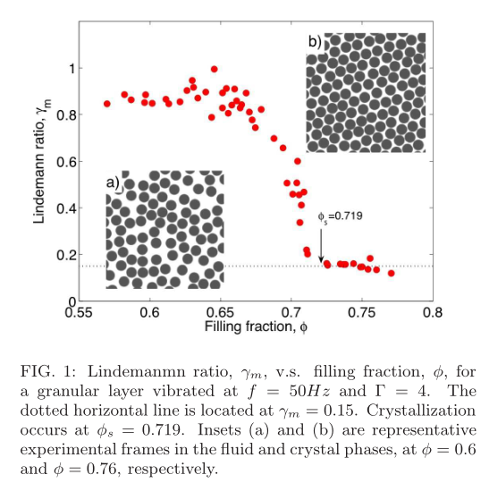[^2]

### Bond-Orientational Order Parameter

#### global[^2]

$$
\psi_6^{global}=\left|1 / M \sum_{i=1}^{M} 1 / N_{i} \sum_{j=1}^{N_{i}} e^{i 6 \theta_{i j}}\right|
$$

Nearest neighbours

ordered: $\psi_6^{global}\approx 1$
disordered: $\psi_6^{global}\ll1$

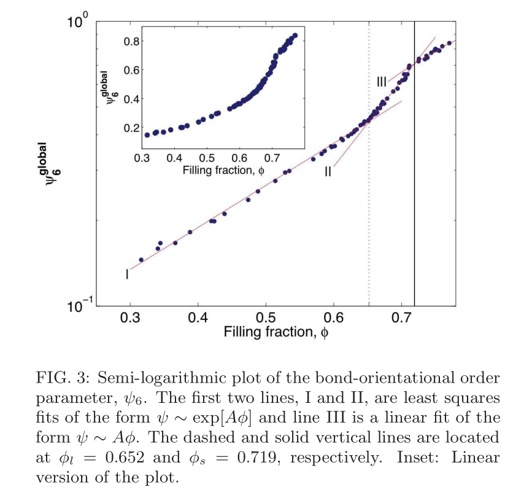[^2]

#### spacial correlation

$$
\begin{aligned}
G_{6}(r)=\left\langle\psi(\vec{r}) \psi^{*}(0)\right\rangle \\
\psi(\vec{r})=\psi_{k}=\frac{1}{N_{k}} \sum_{j} e^{i 6 \theta_{j k}}
\end{aligned}
$$

==KTHNY theory==

$\lim _{r \rightarrow \infty} G_{6}(r) \neq 0 \quad$ crystal: long-range order,

$G_{6}(r) \sim r^{-\eta_{6}} \quad$ hexatic: quasi-long-range order,

$G_{6}(r) \sim e^{-r / \xi_{6}} \quad$ isotropic: short-range order.

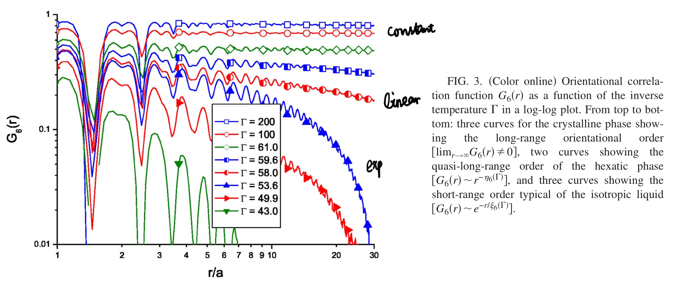[^3]

$$
\xi_{6}(\Gamma) \sim \exp \left(\frac{b}{\left|1 / \Gamma-1 / \Gamma_{i}\right|^{\nu}}\right)
$$

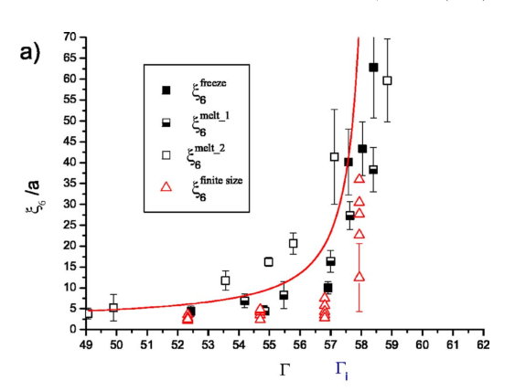[^3]

#### local bond-order

$$
m_{6_k}=|\psi_k|
$$
projection

$$
n_{6_{k}}=\left|\psi_{k}^{*} \frac{1}{N_{l}} \sum_{l} \psi_{l}\right|
$$

$$m_{6_k}\ge n_{6_k}$$

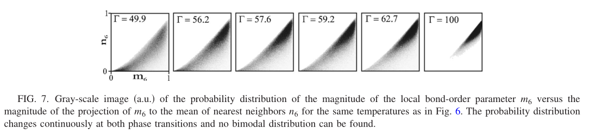[^3]

#### Temporal Correlation

$$
g_{6}(t)=\operatorname{Re}\left\langle\frac{\psi_{6, i}(t) \cdot \psi_{6, i}^{*}(0)}{\left|\psi_{6, i}\right|^{2}}\right\rangle
$$

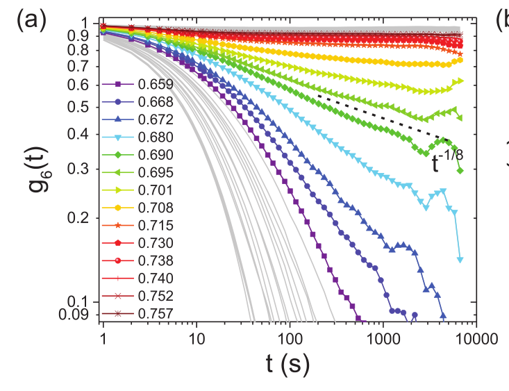 [^19]

### Shape Factor

Voronoi cell

$$
\zeta_{i}=C_{i}^{2} / 4 \pi S_{i}
$$

For circles ζ = 1 and ζ > 1 for all other shapes 
* ζ = 4/π ∼ 1.273 for square,
* ζ =π/5tan(π/5) ∼ 1.156 for regular pentagons,
* ζ =6/ √ 3π 2 ∼ 1.103 for regular hexagons

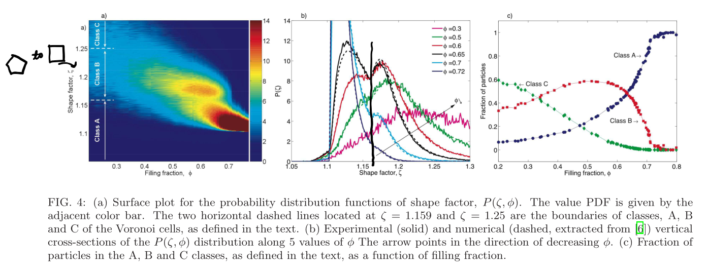[^2]

### Structure Factor

$$
S(\vec{q})=\frac{1}{N}\left\langle\sum_{\alpha, \alpha^{\prime}} e^{-i \vec{q} \cdot\left(\vec{r}_{\alpha}-\vec{r}_{\alpha^{\prime}}\right)}\right\rangle
$$

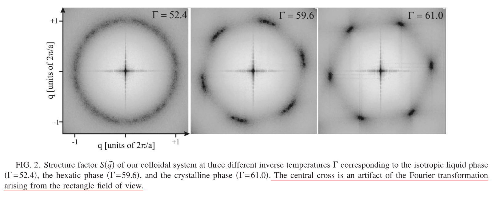[^3]

### Mean Square Displacement

$$
M(t)=\lang{\left[\vec{r}(t)-\vec{r}(0)\right]^2}\rang
$$

ensemble average

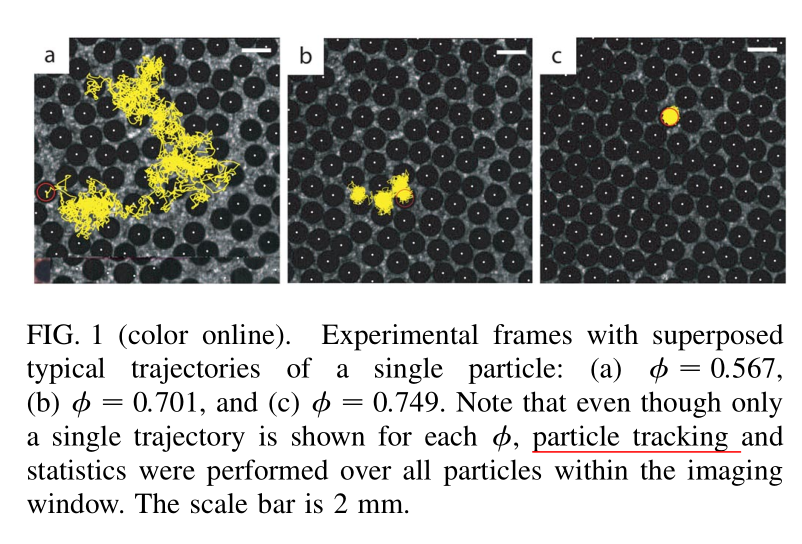[^4]

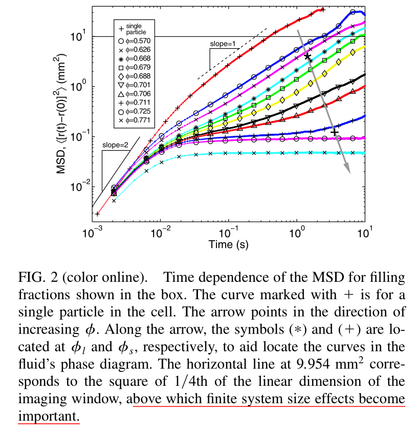

### Scattering Function

$$
F_{s}( \vec{q} , t)=\frac{1}{N} \sum_{j}\left\langle\exp \left(-i \vec{q} \cdot\left[ r _{j}(t)- r _{j}(0)\right]\right)\right\rangle
$$

Stretched Exponential

$$
F_{s}(q, t) \sim \exp \left\{-[t / \tau(q)]^{\beta(q)}\right\}
$$

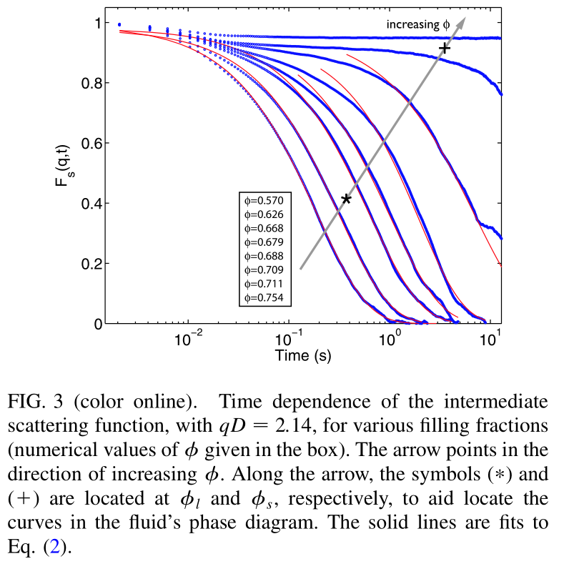

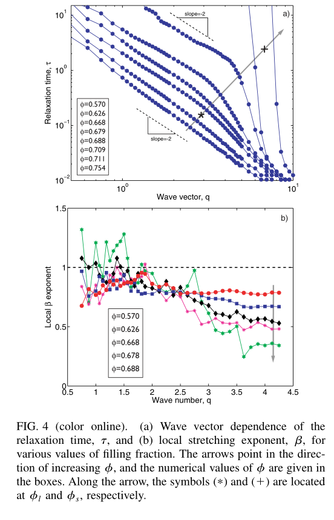

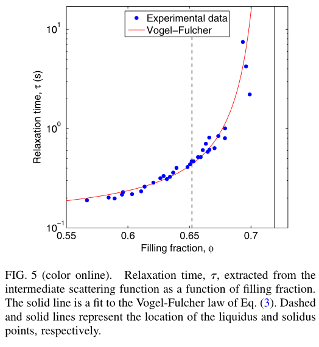[^4]

## Assignment 13th Aug.

* List the formula used.
* Look for positional order parameter that would not be disturbed by angular disorder.
* Rate of collision?

### Translational order parameter

$$
\Psi_{T j}=\exp \left(i G \cdot r _{j}\right)
$$

where $G$ is a primary reciprocal lattice vector, and $r_j = (x_j , y_j )$

$$
g_{T}(t)=\left\langle\psi_{T j}^{*}(\tau) \psi_{T j}(\tau+t)\right\rangle
$$[^8]

## References

[^1]:Olafsen, J. S. & Urbach, J. S. Clustering, Order, and Collapse in a Driven Granular Monolayer. Phys. Rev. Lett. 81, 4369–4372 (1998).
[^2]:Reis, P. M., Ingale, R. A. & Shattuck, M. D. Crystallization of a quasi-two-dimensional granular fluid. Physical Review Letters 96, 258001 (2006).
[^3]:Keim, P., Maret, G. & von Grünberg, H. H. Frank’s constant in the hexatic phase. Phys. Rev. E 75, 031402 (2007).
[^4]:Reis, P. M., Ingale, R. A. & Shattuck, M. D. Caging Dynamics in a Granular Fluid. Phys. Rev. Lett. 98, 188301 (2007).
[^5]:Gasser, U. Crystallization in three- and two-dimensional colloidal suspensions. J. Phys.: Condens. Matter 21, 203101 (2009).
[^6]:Millan, J. A., Ortiz, D., van Anders, G. & Glotzer, S. C. Self-Assembly of Archimedean Tilings with Enthalpically and Entropically Patchy Polygons. ACS Nano 8, 2918–2928 (2014).
[^7]:Kapfer, S. C. & Krauth, W. Two-dimensional melting: From liquid-hexatic coexistence to continuous transitions. Physical review letters 114, 035702 (2015).
[^8]:Sun, X., Li, Y., Ma, Y. & Zhang, Z. Direct observation of melting in a two-dimensional driven granular system. Sci Rep 6, 24056 (2016).
[^9]:Walsh, L. & Menon, N. Ordering and dynamics of vibrated hard squares. J. Stat. Mech. 2016, 083302 (2016).
[^10]:Anderson, J. A., Antonaglia, J., Millan, J. A., Engel, M. & Glotzer, S. C. Shape and symmetry determine two-dimensional melting transitions of hard regular polygons. Phys. Rev. X 7, 021001 (2017).
[^11]:Thorneywork, A. L., Abbott, J. L., Aarts, D. G. A. L. & Dullens, R. P. A. Two-Dimensional Melting of Colloidal Hard Spheres. Phys. Rev. Lett. 118, 158001 (2017).
[^12]:Windows-Yule, C. R. K. Do granular systems obey statistical mechanics? A review of recent work assessing the applicability of equilibrium theory to vibrationally excited granular media. Int. J. Mod. Phys. B 31, 1742010 (2017).
[^13]:Digregorio, P. et al. Full phase diagram of active Brownian disks: From melting to motility-induced phase separation. Physical review letters 121, 098003 (2018).
[^14]:Klamser, J. U., Kapfer, S. C. & Krauth, W. Thermodynamic phases in two-dimensional active matter. Nature communications 9, 1–8 (2018).
[^15]:Thorneywork, A. L., Abbott, J. L., Aarts, D. G., Keim, P. & Dullens, R. P. Bond-orientational order and Frank’s constant in two-dimensional colloidal hard spheres. Journal of Physics: Condensed Matter 30, 104003 (2018).
[^16]:Ormrod Morley, D., Thorneywork, A. L., Dullens, R. P. A. & Wilson, M. Generalized network theory of physical two-dimensional systems. Phys. Rev. E 101, 042309 (2020).
[^17]:Shaebani, M. R., Wysocki, A., Winkler, R. G., Gompper, G. & Rieger, H. Computational models for active matter. Nat Rev Phys 2, 181–199 (2020).
[^18]:Siboni, N. H., Thorneywork, A. L., Damm, A., Dullens, R. P. A. & Horbach, J. Long-time self-diffusion in quasi-two-dimensional colloidal fluids of paramagnetic particles. Phys. Rev. E 101, 042609 (2020).
[^19]:Thorneywork, A. L., Abbott, J. L., Aarts, D. G., Keim, P. & Dullens, R. P. Bond-orientational order and Frank’s constant in two-dimensional colloidal hard spheres. Journal of Physics: Condensed Matter 30, 104003 (2018).
