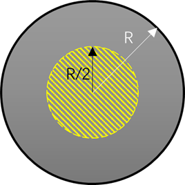
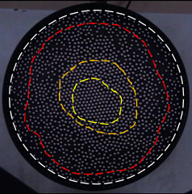

# The study of 2D phase transition in a granular system

## Key problems

### Global behavior (yellow region)

- [ ] Radial distribution function vs filling factor
- [ ] Velocity (x y and absolute value) distribution vs filling factor
- [ ] Positional order parameter vs filling factor
- [ ] Rotational order parameter vs filling factor
- [ ] Absolute value of 2D FFT vs filling factor
- [ ] Lindemann parameter vs filling factor

### Distinct behaviors in segregated regions and local parameters

- [ ] Define the proper local order parameters: local positional order parameter, local rotational order parameter etc.
- [ ] Distinguish the regions by local order parameters
- [ ] Positional order parameter vs r at different regions
- [ ] Rotational order parameter vs r at different regions 
- [ ] Absolute value of 2D FFT at different regions
- [ ] Lindemann parameter vs r
- [ ] Velocity (x y and absolute value) distribution at different regions

### From gas to liquid, from hexatic to solid?

- [ ] How to define the phases?
- [ ] What theories does the phase transition follow?  KTHNY?
- [ ] What kind of velocity distribution fits the phase? Any theories? 
- [ ] Why there are different regions?
